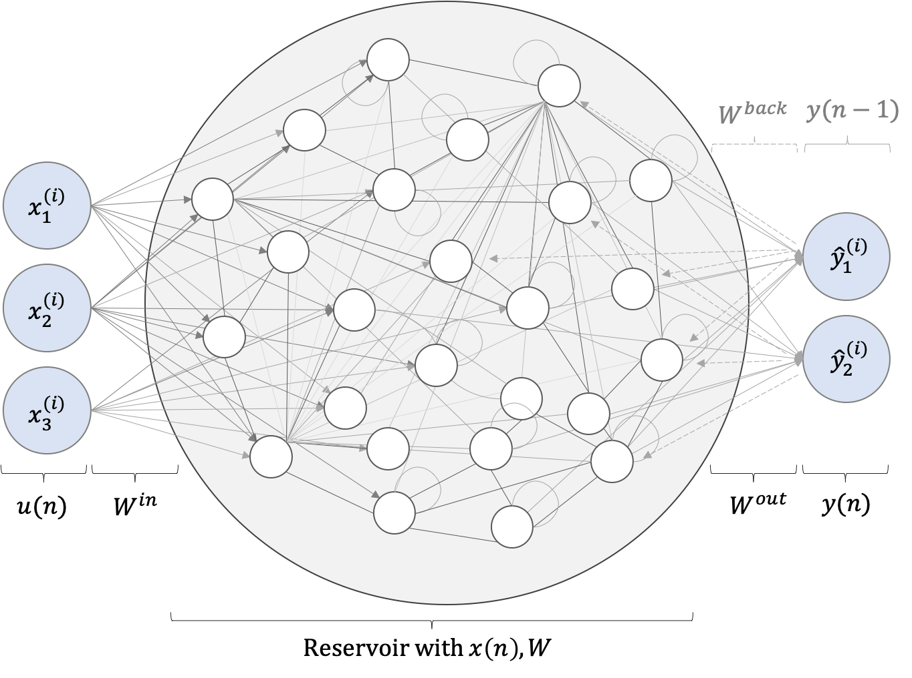

<div align='center'>
  
</div>

## Echo State Networks

This repository implements [Echo State Networks](http://www.scholarpedia.org/article/Echo_state_network) in Python 3.6

### Getting Started

```py
import EchoStateNetwork
import dataUtils

my_ESN = EchoStateNetwork.EchoStateNetwork(nInputNodes=3,
                                            nOutputNodes=2, 
                                            internalNodes=50)

my_ESN.fit(data, nForgetPoint=100)
forecast = my_ESN.forecast(data, index, forecastHorizon, windowMode)
```

### Documentation
***
#### _class_ EchoStateNetwork(nInputNodes, nOutputNodes, internalNodes)
###### Input Arguments

* **nInputNodes**, required, integer >=1, Sets the number of input time series for the ESN
* **nOutputNodes**, required, integer >=1, Sets the number of output time series for the ESN
* **internalNodes**, required, integer >=1, Defines the size of the quadratic reservoir matrix
* _inputScaling_, optional, float >=0.0, default: 1.0, Scales the input
* _inputShift_,optional, float, default: 0.0, Shifts the input
* _regressionLambda_, optional, float >0.0, default: 1e-12, Regularization parameter for the regression
* _spectralRadius_, optional, float >0.0, default: 0.7, SpectralRadius for the reservoir (<1.2 recommended)
* _leakingRate_, optional, float 1.0>x>0.0, default: 0.0, Inertia parameter for the reservoir state
* _connectivity_, optional, float 1.0>x>0.0, default: 10/internalNodes, Sparsity of the reservoir matrix
* _inputMask_, optional, float(nInputNodes,1), default: 1*(nInputNodes,1), Filter for the input
***
    
#### _class method_ EchoStateNetwork.fit(data)
###### Input Arguments

* **data**, required, _class_ Data, contains the data
* _nForgetPoints_, optional, integer >0, default: 100, Initial reservoir states that should be forgotten
    
#### _class method_ EchoStateNetwork.forecast()
###### Input Arguments
+++ tbd +++   
###### Output Arguments


### References
Developed in Python 3.6.9

The code in this file is inspired by an ESN implementation in MATLAB by H. Jaeger`

Jaeger, Herbert, "The echo state approach to analysing and training recurrent neural networks-with an erratum note",
Bonn, Germany: German National Research Center for Information Technology GMD Technical Report 148, 34 (2001), pp. 13.

The code was formatted using [Black](https://github.com/psf/black)